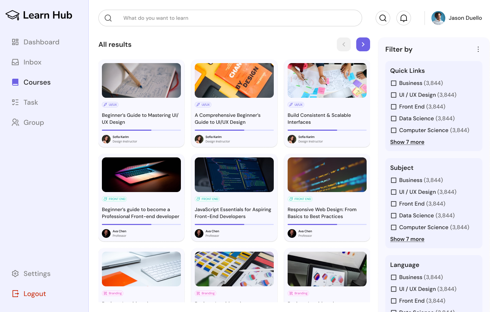
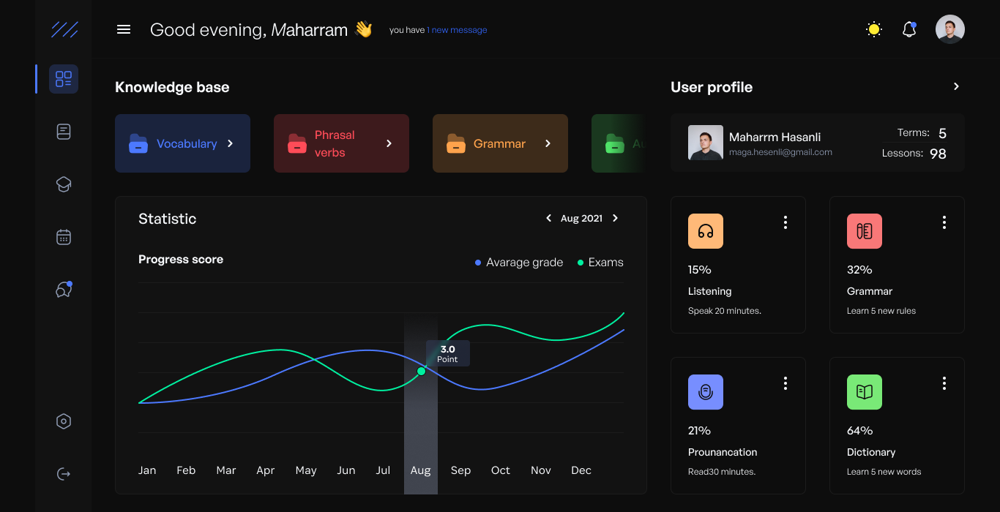

https://www.figma.com/community/file/1501554553193657874/educational-insights-dashboard?q_id=b28d1c32-7401-40d4-90fa-a1727c05e28b&fuid=1612802820373447077
Escolhido pela maneira que separa as coisas, sem lançar muito conteúdo na pessoa ao abrir alguma página,
aba de "continue" que facilita o uso contínuo e filtragem.

.

http://figma.com/community/file/1038033084068266047/educational-platform-student-dashboard-light-and-dark-mode?q_id=b28d1c32-7401-40d4-90fa-a1727c05e28b&fuid=1612802820373447077
Escolhido pelo design mais simples e direto e área de usuário mais confortável

.